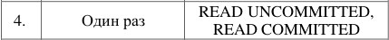
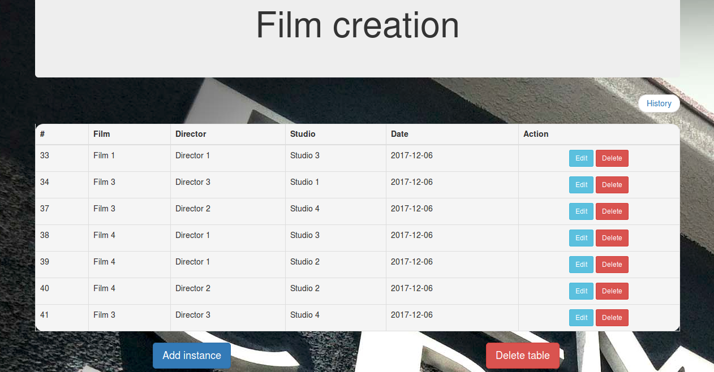
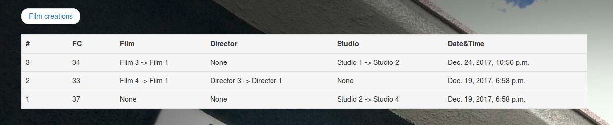

Lab3 DataBases
====
Variant:
---

***
Facts table:
---

***
History (trigger works):
---

***
SQL:
---
[Trigger](./SQL/lab3_trigger_and_procedure.sql)
***
[Procedure](./SQL/lab3_trigger_and_procedure.sql)
***
[Event](./SQL/lab3_event.sql)
